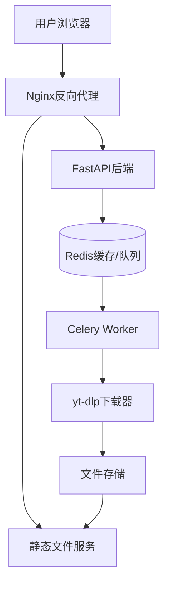
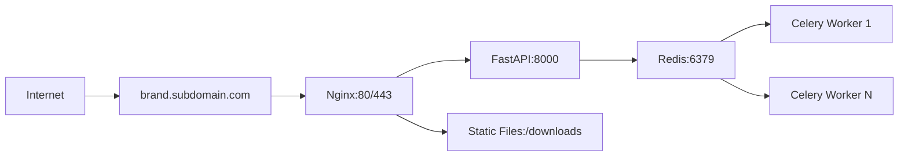

# Design Document

## Overview

Gravity v0.1 is a containerized web application that provides video downloading capabilities from multiple platforms (Bilibili, YouTube) through a clean web interface. The system follows a microservices architecture with clear separation between frontend, API backend, task processing, and file serving components.

The application uses an asynchronous task queue pattern where download requests are immediately queued and processed by background workers, allowing for concurrent downloads and real-time status updates through polling.

## Architecture

### High-Level Architecture



### Technology Stack

**Backend Services:**
- **FastAPI**: REST API server with automatic OpenAPI documentation
- **Celery**: Distributed task queue for handling download jobs
- **Redis 7.x**: Message broker, task queue, and caching layer
- **yt-dlp**: Core video downloading library
- **Uvicorn**: ASGI server for FastAPI

**Frontend:**
- **Vanilla JavaScript (ES6+)**: Client-side logic and API communication
- **HTML5**: Semantic markup structure
- **CSS3**: Styling with Gravity-themed design elements

**Infrastructure:**
- **Docker & Docker Compose**: Containerization and orchestration
- **Nginx**: Reverse proxy and static file serving
- **Ubuntu VPS**: Deployment target environment

### Deployment Architecture



## Components and Interfaces

### 1. FastAPI Backend Service

**Core Responsibilities:**
- Handle HTTP requests and responses
- Validate input data and URLs
- Provide synchronous video info parsing
- Manage task creation and status tracking
- Provide REST API endpoints
- Generate OpenAPI documentation

**Key Endpoints:**
```
POST /api/v1/downloads/info      # Synchronous video info parsing
POST /api/v1/downloads           # Create download task
GET /api/v1/downloads/{task_id}/status
GET /api/v1/downloads/history
GET /api/v1/health
GET /docs (Swagger UI)
```

**Request/Response Models:**
```python
# Video Info Request (Synchronous)
{
    "url": "string"
}

# Video Info Response
{
    "title": "string",
    "duration": "string",
    "formats": [
        {
            "format_id": "string",
            "quality": "1080p|720p|480p",
            "ext": "mp4|webm",
            "filesize": "number"
        }
    ]
}

# Download Request
{
    "url": "string",
    "quality": "1080p|720p|480p|best",
    "format": "video|audio",
    "audio_format": "mp3|m4a" # when format=audio
}

# Task Response (Enhanced with URL field)
{
    "task_id": "uuid",
    "url": "string",  # Original URL included for self-contained data
    "status": "PENDING|DOWNLOADING|COMPLETED|FAILED",
    "progress": "string",
    "title": "string",
    "download_url": "string|null",
    "error_message": "string|null",
    "created_at": "datetime",
    "updated_at": "datetime"
}
```

### 2. Celery Task Processing

**Worker Configuration:**
- Concurrency: Configurable based on CPU cores (recommended: cores * 2)
- Task routing: Single queue for download tasks
- Result backend: Redis
- Task serialization: JSON
- Task timeout: 30 minutes (configurable)
- Retry policy: 3 attempts with exponential backoff

**Core Tasks:**
```python
@celery.app.task(bind=True)
def download_video_task(self, task_id: str, url: str, options: dict)
```

**Progress Callback Integration:**
```python
def progress_hook(d):
    if d['status'] == 'downloading':
        # Update Redis with progress
    elif d['status'] == 'finished':
        # Update Redis with completion
```

### 3. Redis Data Layer

**Data Structures:**

**Task Storage:**
```
Key: task:{task_id}
Type: Hash
Fields: {
    "url": "original_url",
    "status": "PENDING|DOWNLOADING|COMPLETED|FAILED",
    "progress": "progress_string",
    "title": "video_title",
    "file_path": "/opt/gravity/downloads/filename.ext",
    "download_url": "/downloads/filename.ext",
    "error_message": "error_details",
    "created_at": "timestamp",
    "updated_at": "timestamp",
    "options": "json_encoded_options"
}
TTL: 7 days
```

**History Management:**
```
Key: history:downloads
Type: Sorted Set
Score: timestamp
Value: task_id
Max Size: 20 (auto-trim oldest)
```

**Task Queue:**
```
Key: celery
Type: List (Celery default)
```

### 4. Frontend Interface

**Core Components:**

**URL Input Component:**
```javascript
class URLInputComponent {
    validateURL(url)
    submitDownload(url, options)
    showQualityOptions(availableFormats)
}
```

**Task Status Component:**
```javascript
class TaskStatusComponent {
    pollTaskStatus(taskId)
    updateProgressDisplay(progress)
    showDownloadLink(downloadUrl)
}
```

**History Component:**
```javascript
class HistoryComponent {
    loadHistory()
    displayHistoryItems(items)
    handleHistoryItemClick(taskId)
}
```

**API Client:**
```javascript
class GravityAPI {
    async submitDownload(url, options)
    async getTaskStatus(taskId)
    async getHistory()
}
```

### 5. yt-dlp Service Encapsulation

**DownloaderService Class:**
```python
class DownloaderService:
    def __init__(self):
        self.yt_dlp_version = "2023.12.30"  # Pinned version
    
    def get_video_info(self, url: str) -> dict:
        """Synchronous video info extraction"""
        try:
            # yt-dlp info extraction logic
            pass
        except yt_dlp.utils.DownloadError as e:
            # Convert to user-friendly errors
            raise VideoInfoError(self._parse_error(e))
    
    def download_video(self, url: str, options: dict, progress_callback) -> str:
        """Download video with progress tracking"""
        try:
            # yt-dlp download logic
            pass
        except yt_dlp.utils.DownloadError as e:
            # Handle specific error types
            raise DownloadError(self._parse_error(e))
    
    def _parse_error(self, error) -> str:
        """Convert yt-dlp errors to user-friendly messages"""
        # Map specific errors to Chinese messages
        pass
```

**Error Type Mapping:**
```python
ERROR_MESSAGES = {
    "Video unavailable": "视频不存在或已被删除",
    "Private video": "视频为私有，无法访问",
    "Geographic restriction": "视频存在地区限制",
    "Format not available": "指定格式不可用",
    "Network error": "网络连接错误，请稍后重试"
}
```

### 6. File Management System

**Directory Structure:**
```
/opt/gravity/
├── downloads/           # Downloaded files
│   ├── videos/         # Video files
│   └── audio/          # Audio files
├── logs/               # Application logs
└── temp/               # Temporary processing files
```

**Enhanced File Naming Convention:**
```
Format: {sanitized_title}_{task_id}.{ext}
Example: "一场精彩的演讲_c4b9f2c3-5a7a-4d4e-b8d4-8d4e9f2a3b1c.mp4"
```

**File Cleanup Service:**
```python
@celery.app.task
def cleanup_old_files():
    """Daily cleanup task for files older than 7 days"""
    cutoff_date = datetime.now() - timedelta(days=7)
    # Scan and remove old files
    pass
```

**Celery Beat Configuration:**
```python
CELERY_BEAT_SCHEDULE = {
    'cleanup-old-files': {
        'task': 'app.tasks.cleanup_old_files',
        'schedule': crontab(hour=2, minute=0),  # Daily at 2 AM
    },
}
```

**Nginx Static File Configuration:**
```nginx
location /downloads/ {
    alias /opt/gravity/downloads/;
    expires 7d;
    add_header Cache-Control "public, immutable";
}
```

## Data Models

### DownloadTask Model

```python
from enum import Enum
from datetime import datetime
from typing import Optional
from pydantic import BaseModel

class TaskStatus(str, Enum):
    PENDING = "PENDING"
    DOWNLOADING = "DOWNLOADING" 
    COMPLETED = "COMPLETED"
    FAILED = "FAILED"

class DownloadOptions(BaseModel):
    quality: str = "best"
    format: str = "video"  # video|audio
    audio_format: Optional[str] = "mp3"

class DownloadTask(BaseModel):
    task_id: str
    url: str
    status: TaskStatus
    progress: str = ""
    title: str = ""
    file_path: str = ""
    download_url: str = ""
    error_message: str = ""
    options: DownloadOptions
    created_at: datetime
    updated_at: datetime
```

### API Response Models

```python
class VideoInfoRequest(BaseModel):
    url: str

class VideoFormat(BaseModel):
    format_id: str
    quality: str
    ext: str
    filesize: Optional[int] = None

class VideoInfoResponse(BaseModel):
    title: str
    duration: Optional[str] = None
    formats: List[VideoFormat]

class TaskResponse(BaseModel):
    task_id: str
    url: str  # Original URL included for self-contained data
    status: TaskStatus
    progress: Optional[str] = None
    title: Optional[str] = None
    download_url: Optional[str] = None
    error_message: Optional[str] = None
    created_at: datetime
    updated_at: datetime

class DownloadRequest(BaseModel):
    url: str
    quality: str = "best"
    format: str = "video"
    audio_format: Optional[str] = "mp3"

class HistoryResponse(BaseModel):
    tasks: List[TaskResponse]
    total: int
```

## Error Handling

### API Error Responses

**Standard Error Format:**
```json
{
    "error": {
        "code": "ERROR_CODE",
        "message": "Human readable message",
        "details": "Additional context"
    },
    "timestamp": "2024-01-16T14:30:22Z"
}
```

**Error Categories:**

1. **Validation Errors (400)**
   - Invalid URL format
   - Unsupported platform
   - Missing required parameters

2. **Processing Errors (422)**
   - Video unavailable
   - Geographic restrictions
   - Format not available

3. **System Errors (500)**
   - Redis connection failure
   - File system errors
   - yt-dlp execution errors

4. **Rate Limiting (429)**
   - Too many concurrent downloads
   - Platform rate limits

### Frontend Error Handling

```javascript
class ErrorHandler {
    handleAPIError(error) {
        switch(error.code) {
            case 'INVALID_URL':
                this.showURLError(error.message);
                break;
            case 'DOWNLOAD_FAILED':
                this.showDownloadError(error.message);
                break;
            default:
                this.showGenericError(error.message);
        }
    }
}
```

### Celery Task Error Handling

```python
@celery.app.task(bind=True, autoretry_for=(Exception,), retry_kwargs={'max_retries': 3})
def download_video_task(self, task_id: str, url: str, options: dict):
    try:
        # Download logic
    except YoutubeDLError as e:
        # Update task status to FAILED
        # Store error message
        raise
    except Exception as e:
        # Log unexpected errors
        # Retry or fail based on error type
        raise
```

## Testing Strategy

### Unit Testing

**Backend Tests:**
```python
# test_api.py
def test_submit_download_valid_url()
def test_submit_download_invalid_url()
def test_get_task_status_existing()
def test_get_task_status_nonexistent()

# test_tasks.py  
def test_download_video_success()
def test_download_video_failure()
def test_progress_callback_updates()

# test_models.py
def test_download_task_validation()
def test_task_status_transitions()
```

**Frontend Tests:**
```javascript
// test_api_client.js
describe('GravityAPI', () => {
    test('submitDownload with valid URL')
    test('getTaskStatus polling')
    test('error handling')
})

// test_components.js
describe('URLInputComponent', () => {
    test('URL validation')
    test('quality selection')
    test('form submission')
})
```

### Integration Testing

**API Integration Tests:**
```python
def test_full_download_workflow():
    # Submit download -> Check status -> Verify file
    
def test_concurrent_downloads():
    # Multiple simultaneous downloads
    
def test_error_recovery():
    # Redis failure scenarios
```

**End-to-End Testing:**
```javascript
// e2e_tests.js
describe('Download Workflow', () => {
    test('Complete video download process')
    test('Audio-only download process')
    test('Error handling display')
    test('History functionality')
})
```

### Performance Testing

**Load Testing Scenarios:**
- 10 concurrent downloads
- 100 status polling requests/second
- Redis memory usage under load
- File system I/O performance

**Monitoring Metrics:**
- Task completion time
- Memory usage per worker
- Redis connection pool utilization
- Nginx response times

### Docker Testing

```bash
# Container health checks
docker-compose exec api curl http://localhost:8000/api/v1/health
docker-compose exec redis redis-cli ping
docker-compose exec worker celery -A app.celery inspect active

# Integration testing
docker-compose run --rm test pytest tests/integration/
```

This design provides a robust, scalable foundation for the Gravity video downloader that meets all the specified requirements while maintaining clean architecture and separation of concerns.